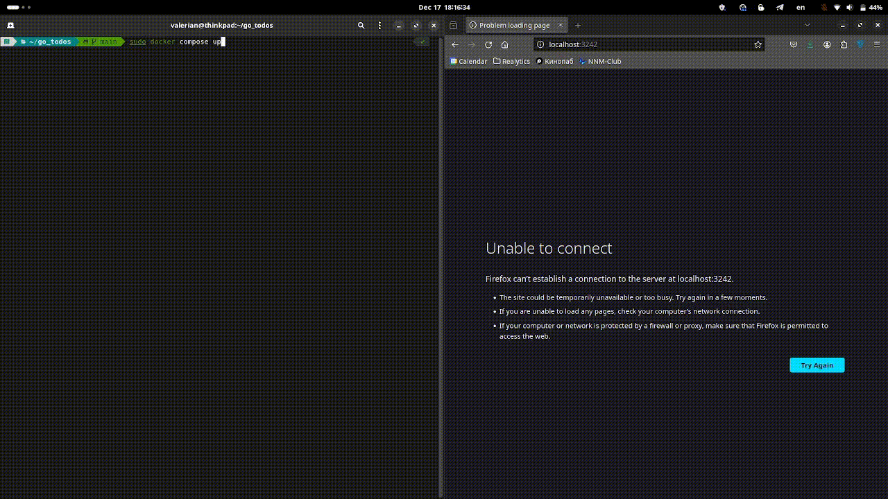

## Demo


## How to start

```bash
sudo docker-compose up
```

Затем в браузере приложение будет доступно по URL
```
localhost:3242
```


## Sources

Основная часть логики и интерфейс на HTMX взят из серии видео:
* https://www.youtube.com/playlist?list=PLbOlUnwzq2UcoI2XzRqc_h5bdre_WLQ83


За основу структуры проекта взяты репозитории
* https://github.com/paganotoni/todox
* https://github.com/guilycst/go-htmx-todo-list

